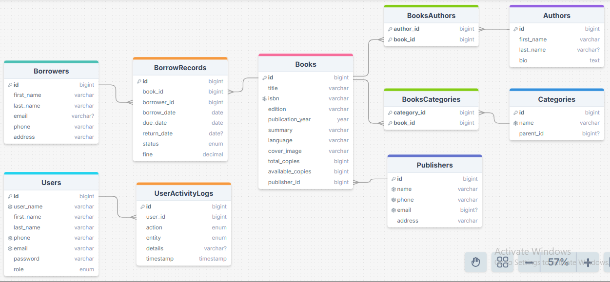

# Library Management System 📚 (Spring Boot Backend)

A **secure and role-based backend application** to efficiently manage library operations, including books, members, and staff, built with **Spring Boot & MySQL**.  

This project demonstrates key backend development skills such as **RESTful API design, JPA/Hibernate integration, role-based access control, and secure user authentication**.

Designed to showcase practical skills in **Java backend development and database management**, following clean architecture and best practices.

---

## 🧠 Features

- ✅ **Role-based access control:** Administrator, Librarian, Staff  
- 📘 **Book management:** CRUD operations with extended metadata (title, authors, publisher, categories, language, ISBN, edition, summary, cover image)  
- 👩‍💼 **Member management:** Register, login, update profiles  
- 🏢 **System user management:** Role-based permissions, secure password storage, authentication, activity logging  
- 📊 **Borrowing & return functionality:** Track book loans, due dates, return status, and fines  
- 🔁 **Database integration:** JPA/Hibernate ORM for all entities  
- 🔐 **Validation & error handling:** Input validation, structured API responses, exception handling  
- 📂 **SQL scripts included:** Sample data and database initialization  
- 📦 **Clean architecture:** Layered structure (Controller → Service → Repository)

---

## 🗄 Database Design (ERD)

The database schema is designed to support a scalable and flexible library management system, handling books, users, and borrowing transactions efficiently while ensuring data consistency and security.

### Core Entities

- **Books**
  - Stores extended metadata: title, ISBN, edition, publication year, summary, language, cover image
  - Tracks total and available copies
  - Relationships:
    - Many-to-Many with **Authors**
    - Many-to-Many with **Categories**
    - Many-to-One with **Publisher**

- **Authors**:  
  - Stores author details such as name and biography

- **Categories**:  
  - Supports hierarchical structure (parent-child) for genre classification  
  - Example: Fiction → Mystery

- **Borrowers**:  
  - Represents library members
  - Stores personal information (name, email, phone, address)

- **BorrowRecords**:  
  - Tracks borrowing transactions
  - Includes borrow date, due date, return date, status, and fines
  - Links borrowers with books  

- **Users**:  
  - Represents system users (Administrator, Librarian, Staff)
  - Implements role-based access control using ENUM roles 

- **UserActivityLogs**:  
  - Logs system activities such as create, update, delete, login, borrow, and return
  - Ensures auditing and accountability

---

📌 **Why this design?**  
- Normalized schema ensures data consistency and avoids duplication  
- Flexible Many-to-Many relationships support multiple authors and categories per book  
- Role-based access control enhances system security  
- `BorrowRecords` decouples borrowing logic from books and users  
- Activity logging provides transparency and auditability

